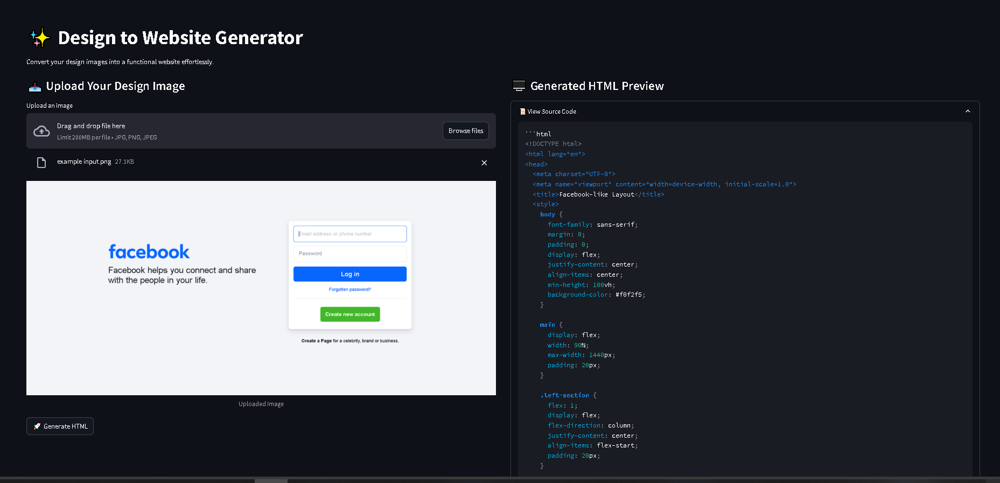

# Design to Website 





This  allows users to upload a design image (e.g., JPG, PNG, JPEG) and converts the image into an HTML code representation. This  uses Optical Character Recognition (OCR) to extract the layout from the image and generates HTML code based on the detected layout. It utilizes the power of Google's Generative AI and LangChain to create an accurate HTML structure.

## Features

- **OCR Processing**: Extracts layout from uploaded images using OCR.
- **HTML Generation**: Converts the extracted layout into HTML code.
- **Streamlit UI**: Interactive web interface for image uploading and displaying the generated HTML.
- **Google Generative AI**: Leverages Google’s Gemini-1.5-flash-8b model for HTML generation.
- **Custom Prompt**: A custom template is used to guide the HTML generation process.

## Prerequisites

Before running the app, make sure you have the following:

- Python 3.9 or higher
- Google API Key (for using the Google Generative AI model)
- Required Python packages: `streamlit`, `langchain`, `PIL`, `dotenv`, `Image2Code`

## Installation

1. Clone this repository:
   ```bash
   git clone https://github.com/PriyanshuDey23/Image2Code.git
   ```

2. Navigate to the project directory:
   ```bash
   cd <project_directory>
   ```

3. Install the required dependencies:
   ```bash
   pip install -r requirements.txt
   ```

4. Create a `.env` file in the root directory and add your Google API Key:
   ```
   GOOGLE_API_KEY=<your_google_api_key>
   ```

## Usage

1. Start the Streamlit app:
   ```bash
   streamlit run app.py
   ```

2. Open the app in your browser (usually at `http://localhost:8501`).

3. Upload your design image (in JPG, PNG, or JPEG format).

4. Click on the "Run" button to process the image and generate the corresponding HTML.

5. Once the process is complete, the generated HTML code will be displayed in the app. You can view the HTML source code or see a live preview of the HTML layout.

## Components

- **OCR Processor**: Extracts layout from the uploaded image.
- **LangChain**: Used for creating a prompt template and chain to generate HTML from the extracted layout.
- **Streamlit**: Provides the web interface for image upload and displaying results.
- **Google Generative AI**: The AI model used to generate HTML code.

## Customization

You can modify the custom prompt template (`CUSTOM_PROMPT_TEMPLATE`) in the code to adjust the HTML generation logic to your needs.

## License

This project is licensed under the MIT License - see the [LICENSE](LICENSE) file for details.
